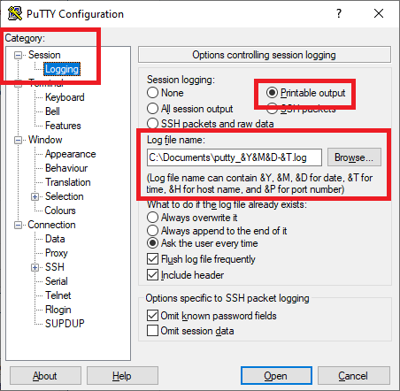
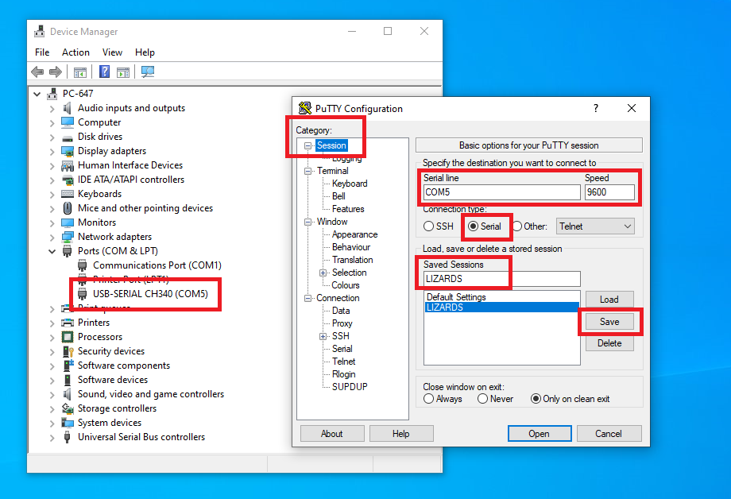
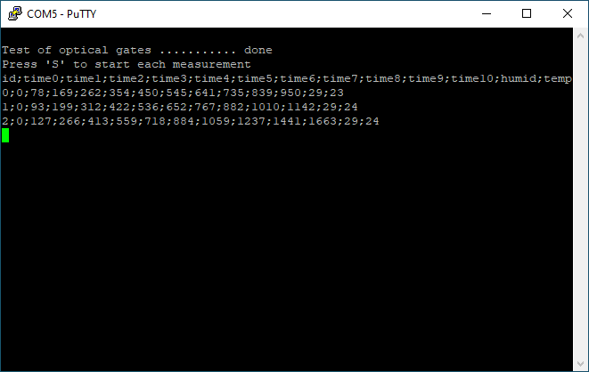
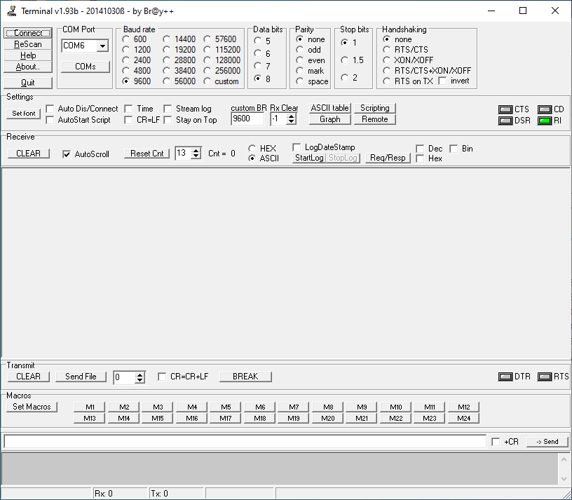
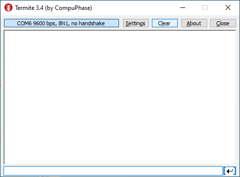
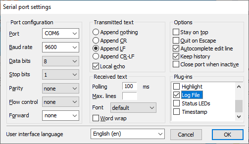

# Measuring track for lizards

## ToC
* [TODO](#TODO)
* [About](#About)
* [Usage](#Usage)
  * [PuTTY for Windows and Linux](#PuTTY-for-Windows-and-Linux)
  * [Terminal for Windows](#Terminal-for-Windows)
  * [Termite for Windows](#Termite-for-Windows)
* [Programming Arduino using PlatformIO](#Programming-Arduino-using-PlatformIO)
* [References](#References)

## TODO

* [x] Instructions for use & program
* [x] Logging data to a file
* [x] Selecting a suitable Monitor program (PuTTY, Terminal, Terminte, PlatformIO, ...)
* [x] Strengthen the mechanics
* [x] Add "start box"
* [ ] Add waterproof paint
* [ ] Cover electronics, 3D printing
* [x] Q: Consumption? A: approx. 350 milliamps
* [x] Q: IR wavelength A: 940 nm
* [ ] Q: Do I need to install USB driver? A: ??

## About

The measuring path contains 11 optical wounds, i.e. pairs of 940 nm infrared diodes and phototransistors. The first gate is the starting gate, the others are spaced 10 centimeters apart. The length of the track is thus 1 meter. Combine temperature and humidity sensor is used as well.

The ATmega328P microcontroller on the Arduino Nano board provides data acquisition from optical gates, time, temperature and humidity measurement, and data sending. The measuring track is powered via a mini USB connector, and at the same time, all data about the measurement progress is sent to the computer/laptop via this USB. Values are separated by semicolumn ";" symbol and can be subsequently processed, for example, in Excel.

## Usage

Once the microcontroller is programmed, on the PC/laptop just run one of the programs that can communicate with the serial port, such as PuTTY, Terminal, Termite, or other.

Perform the following steps to measure the speed of lizards:

1. Connect your computer/laptop to the Arduino board using a USB cable.

2. Run PuTTY, Terminal, Termite, or other serial terminal.

3. Configure terminal to save measured data to log text file.

4. Press `S` on keyboard to start the measurement. Status LED on Arduino board is turn on.

5. Place the lizard in the starting position and let it run through the entire track.

6. The individual times are written to the serial terminal (and the log file) after all gates have been interrupted or after the maximum time has expired. This is set to 60 seconds and can be reprogrammed in the Arduino Nano.

7. Go back to point 4 and repeat.

### PuTTY for Windows and Linux

1. Download, install, and run PuTTY open-source application for [Windows](https://putty.org/) or [Linux](https://www.tecmint.com/install-putty-on-linux/).

2. Set the following parameters:

   a. Category: Session Logging: **Printable output**

   b. Select Log file name, such as: `C:\Documents\your-user-name\putty_&Y&M&D-&T.log`

      

   c. Change Category to **Session** and select Connection type: **Serial**

   d. Serial line: put your com port, such as **COM5** (Windows) or `/dev/ttyUSB0` (Linux)

      > **Help:** To get the port name, run the Device Manager on Windows or type `dmesg` command to Terminal in Linux.

   e. Speed: **9600**

   f. Name Save Sessions: **LIZARDS** and click on **Save** button

   g. Anytime in the future, there is no need to configure PuTTY again, just double click on saved default settings **LIZARDS** to open the connection.

      

   h. Press `S` on keyboard to start each measurement.

      

   i. Values are saved to your log file.

      

### Terminal for Windows

1. Download, unzip, and run the [Terminal](https://sites.google.com/site/terminalbpp/) application.

2. TBD

   

### Termite for Windows

1. Download, install, and run [Termite](https://www.compuphase.com/software_termite.htm#EDITHISTORY) application.

2. TBD

   
   

## Programming Arduino using PlatformIO

1. Follow [Installation](https://github.com/tomas-fryza/digital-electronics-2/wiki/How-to-use-AVR-template-with-PlatformIO) instruction and download & install Visual Studio Code and PlatformIO plugin.

2. Download this repository, ie. in [browser](https://github.com/tomas-fryza/arduino-lizards), click on green `<> Code` button and select `Download ZIP`. Extract zip file to your local computer.

3. In Visual Studio Code, select **File > Open Folder...** and browse to `arduino-lizards/software/lizards` extracted folder.

4. In `platformio.ini` configuration file change your port name, such as COM5 for Windows:

   ```asm
   ; Custom monitor port
   ; Windows:
   monitor_port = COM[5]
   ; Linux:
   ; monitor_port = /dev/ttyUSB0
   ```

5. The application is programmed in C++ and is located in the file `src > main.cpp`

6. Compile the code, run the application, and open Serial Monitor to control it.

   

## References

1. Michaela Ryšavá. [Vývoj systému pro měření pohybových schopností malých živočichů](https://www.vut.cz/studenti/zav-prace/detail/141521)

2. Les Pounder. [How To Detect the COM Port for Any Serial Device in Windows](https://www.tomshardware.com/how-to/detect-com-port-windows-serial-port-notifier)

3. Martins D. Okoi. [How to Install PuTTY on Linux](https://www.tecmint.com/install-putty-on-linux/)
