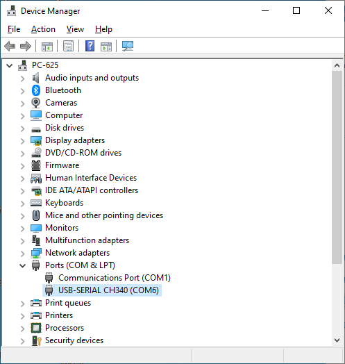
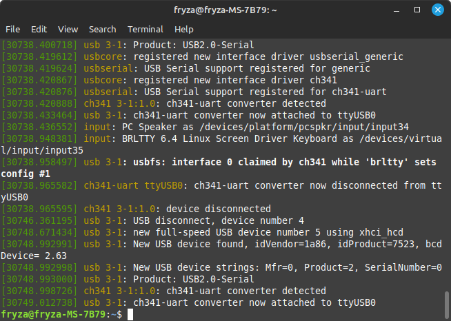

# Measuring track for lizards

## TODO

* [ ] Instructions for use
* [ ] Logging data to a file
* [ ] Selecting a suitable Monitor program (PlatformIO, Arduino IDE, PuTTY, Terminal, Termite, ...)
* [x] Strengthen the mechanics
* [x] Add "start box"
* [ ] Add waterproof paint
* [ ] Cover electronics, 3D printing
* [x] Q: Consumption? A: approx. 350 milliamps
* [x] Q: IR wavelength A: 940 nm
* [ ] Q: Do I need to install USB driver? A: ??

## About

The measuring path contains 11 optical wounds, i.e. pairs of 940 nm infrared diodes and phototransistors. The first gate is the starting gate, the others are spaced 10 centimeters apart. The length of the track is thus 1 meter.

The ATmega328P microcontroller on the Arduino Nano board provides data acquisition from optical gates, time measurement and data sending. The measuring track is powered via a mini USB connector, and at the same time, all data about the measurement progress is sent to the computer/laptop via this USB.

Once the microcontroller is programmed, on the PC/laptop just run one of the programs that can communicate with the serial port, such as PuTTY, Terminal, Termite, or other.

## Usage

Perform the following steps to measure the speed of lizards:

1. Connect your computer/laptop to the Arduino board using a USB cable.

2. Run PuTTY, Terminal, Termite, or other serial terminal.

3. Configure terminal to save measured data to log text file.

4. Press `S` on keyboard to start the measurement. Status LED on Arduino board is turn on.

5. Place the lizard in the starting position and let it run through the entire track.

6. The individual times are written to the serial terminal (and the log file) after all gates have been interrupted or after the maximum time has expired. This is set to 60 seconds and can be reprogrammed in the Arduino Nano.

7. Go back to point 4 and repeat.

### PuTTY for Windows and Linux

1. Download, install, and run PuTTY open-source application for [Windows](https://putty.org/) or [Linux](https://www.tecmint.com/install-putty-on-linux/).

2. Set the following parameters:

   a. Connection type: **Serial**

   b. Serial line: your-com-port, such as COM1 or `/dev/ttyUSB0`

      > **Help:** To get the port name, run the Device Manager on Windows or type `dmesg` command to Terminal in Linux. Here, the COM6 port on Windows 10 or `/dev/ttyUSB0` port on Linux were detected.
      >
      > 
      > 

   c. Speed: **9600**

   d. Category > Logging, TBD............

      

      

### Terminal for Windows

1. Download, unzip, and run the [Terminal](https://sites.google.com/site/terminalbpp/) application.

2. TBD

   

### Termite for Windows

1. Download, install, and run [Termite](https://www.compuphase.com/software_termite.htm#EDITHISTORY) application.

2. TBD

   
   

## Programming Arduino using PlatformIO

TBD

## References

1. Michaela Ryšavá. [Vývoj systému pro měření pohybových schopností malých živočichů](https://www.vut.cz/studenti/zav-prace/detail/141521)

2. Les Pounder. [How To Detect the COM Port for Any Serial Device in Windows](https://www.tomshardware.com/how-to/detect-com-port-windows-serial-port-notifier)

3. Martins D. Okoi. [How to Install PuTTY on Linux](https://www.tecmint.com/install-putty-on-linux/)
